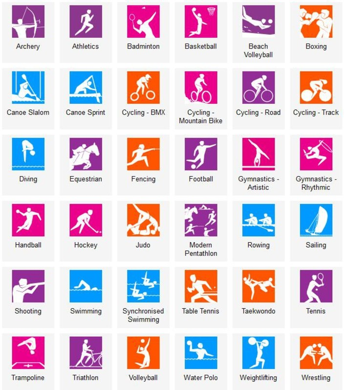

```{r setup, include=FALSE}
library(flexdashboard)
library(tidyverse)
library(plotly)
library(treemapify)
library(gganimate)
data<-read.csv("../athlete_events.csv") 
```

Sport Events {data-orientation=columns}
===================================== 

Column {data-width=300}
-------

### Olympic Games Sport Events



### Olympic Games Sport Events
    
```{r}
# show the change of sport event
fig_dat1<-data %>% filter(Year!=1906) %>% group_by(Year,Season) %>% summarise(Sport_events=n_distinct(Event))

fig1<-fig_dat1 %>% ggplot(aes(x=Year,y=Sport_events,color=Season)) + 
  geom_line() +
  geom_point() +
  labs(x="Year of Olympic Games", y="Number of Sport events") +
  scale_x_continuous(breaks = seq(1890 , 2016, 12))
  
ggplotly(fig1)
```


Column {.tabset data-width=700}
-------       
### 2016 Rio Olympic Summer Games

```{r}
fig_dat2<-data %>% filter(Year==2016 & Season=="Summer") %>% group_by(Sport) %>% summarise(Sport_events=n_distinct(Event))

fig_dat2 %>% ggplot(aes(area=Sport_events, fill=Sport, label=paste(Sport, Sport_events))) +
  geom_treemap() +
  geom_treemap_text(colour = "white",
                    place = "centre",
                    size = 10,
                    grow = TRUE) +
  theme(legend.position = "none") +
  labs(title="Events under 34 sports for 2016 Rio Summer Olympic Games")

```

### 2014 Sochi Olympic Winter Games

```{r}
fig_dat3<-data %>% filter(Year==2014 & Season=="Winter") %>% group_by(Sport) %>% summarise(Sport_events=n_distinct(Event))

fig_dat3 %>% ggplot(aes(area=Sport_events, fill=Sport, label=paste(Sport, Sport_events))) +
  geom_treemap() +
  geom_treemap_text(colour = "white",
                    place = "centre",
                    size = 12) +
  theme(legend.position = "none") +
  labs(title="Events under 15 sports for 2014 Sochi Winter Olympic Games")

```

Athletes {data-orientation=columns}
===================================== 

Column {.tabset data-width=500}
-------

### Summer Olympic Games Athletes
    
```{r}
# show the number of athlete
fig_dat4<-data %>% filter(Season=="Summer" & Year!=1906) %>% group_by(Year,Sex) %>% summarise(Athletes=n_distinct(Name))

fig4<-fig_dat4 %>% ggplot(aes(x=Year,y=Athletes, group=Sex, fill=Sex)) + 
  geom_bar(stat="identity",position = "stack") +
  labs(x="Year of Olympic Games", y="Number of Athletes") +
  scale_x_continuous(breaks = seq(1896 , 2016, 20))

ggplotly(fig4)
```
### Winter Olympic Games Athletes
    
```{r}
# show the number of athlete
fig_dat4<-data %>% filter(Season=="Winter") %>% group_by(Year,Sex) %>% summarise(Athletes=n_distinct(Name))

fig4<-fig_dat4 %>% ggplot(aes(x=Year,y=Athletes, group=Sex, fill=Sex)) + 
  geom_bar(stat="identity",position = "stack") +
  labs(x="Year of Olympic Games", y="Number of Athletes") +
  scale_x_continuous(breaks = seq(1896 , 2016, 20))

ggplotly(fig4)
```


Column {data-width=700}
-------       
### 2016 Rio Olympic Summer Games


Medals {data-orientation=columns}
===================================== 

Column {.tabset data-width=500}
-------

### Summer Olympic Games Gold Medal Leader Board
```{r}
# show the country with most gold Medal for each Summer Olympic Games
fig_dat6<-data %>% filter(Medal=='Gold') %>% 
  filter(Season=="Summer" & Year!=1906) %>%
  group_by(Year,NOC) %>% 
  summarise(Gold_Medal_count=n_distinct(Event)) %>% 
  top_n(1, Gold_Medal_count) %>% arrange(desc(Gold_Medal_count))

fig_dat6 %>% ggplot(aes(x=factor(Year), y=Gold_Medal_count, fill=NOC)) + 
  geom_bar(stat='identity',position =   position_dodge()) + 
  geom_text(aes(x=factor(Year), y=Gold_Medal_count/2,label=NOC),size=2, position =position_dodge(width=1)) +
  geom_text(aes(x=factor(Year), y=Gold_Medal_count*1.05,label=Gold_Medal_count),size=2, position =position_dodge(width=1)) +
  coord_flip() +
  labs(x="Year",y="Gold Medals")

```

### Winter Olympic Games Gold Medal Leader Board
```{r}
# show the country with most gold Medal for each Summer Olympic Games
fig_dat6<-data %>% filter(Medal=='Gold') %>% 
  filter(Season=="Winter") %>%
  group_by(Year,NOC) %>% 
  summarise(Gold_Medal_count=n_distinct(Event)) %>% 
  top_n(1, Gold_Medal_count) %>% arrange(desc(Gold_Medal_count))

fig_dat6 %>% ggplot(aes(x=factor(Year), y=Gold_Medal_count, fill=NOC)) + 
  geom_bar(stat='identity',position =   position_dodge()) + 
  geom_text(aes(x=factor(Year), y=Gold_Medal_count/2,label=NOC),size=2, position =position_dodge(width=1)) +
  geom_text(aes(x=factor(Year), y=Gold_Medal_count*1.05,label=Gold_Medal_count),size=2, position =position_dodge(width=1)) +
  coord_flip() +
  labs(x="Year",y="Gold Medals")

```

Column {.tabset data-width=500}
-------

### Correlation between Athletes and Gold medals
```{r data_3}
sub_data1<-data %>% filter(Medal=='Gold') %>% 
  filter(Season=="Summer" & Year!=1906) %>%
  group_by(Year,NOC) %>% 
  summarise(Gold_Medal_count=n_distinct(Event))

sub_data2<-data %>% filter(Season=="Summer" & Year!=1906) %>%
  group_by(Year, NOC) %>% 
  summarise(athletes_count=n_distinct(Name))

fig_dat7<-merge(sub_data2,sub_data1, by=c("Year","NOC"))

g<-fig_dat7 %>% ggplot(aes(x=athletes_count, y=Gold_Medal_count, color=NOC)) + 
  geom_point(alpha = 0.7) +
  theme(legend.position = 'none') +
  labs(x="Number of athletes", y="Number of gold medal") 

g
  
```

### Correlation between Athletes and Gold medals
```{r data_3}
sub_data1<-data %>% filter(Medal=='Gold') %>% 
  filter(Season=="Winter") %>%
  group_by(Year,NOC) %>% 
  summarise(Gold_Medal_count=n_distinct(Event))

sub_data2<-data %>% filter(Season=="Winter") %>%
  group_by(Year, NOC) %>% 
  summarise(athletes_count=n_distinct(Name))

fig_dat7<-merge(sub_data2,sub_data1, by=c("Year","NOC"))

g<-fig_dat7 %>% ggplot(aes(x=athletes_count, y=Gold_Medal_count, color=NOC)) + 
  geom_point(alpha = 0.7) +
  theme(legend.position = 'none') +
  labs(x="Number of athletes", y="Number of gold medal") 

g
  
```